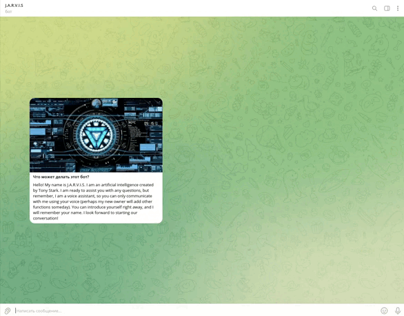

# J.A.R.V.I.S - Telegram Bot

J.A.R.V.I.S is a Telegram bot powered by artificial intelligence, humorously attributed to Tony Stark (just kidding, it's actually just ChatGPT 4o). Its purpose is to assist users with any questions. Currently, it can recognize users' voice messages and respond accordingly.

## About

This project is the result of a test assignment. It implements a simple N-Layer architecture, comprising the presentation layer (handlers), data_access layer, and business_logic layer (services). The bot is built using aiogram3.

## Usage

### Development Environment

1. Create a `.env` file in the root directory and populate it with the required data based on `.env.template`.
2. Initialize Poetry and install dependencies by running `poetry install` in the `src/` directory.
3. To run the application locally, install ngrok and execute the following command: `ngrok http 8000`. Copy the generated HTTPS URL and paste it into the `WEBHOOK_URL` variable in the `.env` file.
4. Start the development server by running `sudo docker compose -f docker-compose-dev.yaml --env-file .env up -d`.
5. Launch the application with `python3 app.py`.

### Production Environment

1. Create a `.env` file in the root directory and populate it with the required data based on `.env.template`.
2. To run the application locally, install ngrok and execute the following command: `ngrok http 8000`. Copy the generated HTTPS URL and paste it into the `WEBHOOK_URL` variable in the `.env` file.
3. Start the production server by running `sudo docker compose -f docker-compose-prod.yaml --env-file .env up -d`.

## Demonstration

